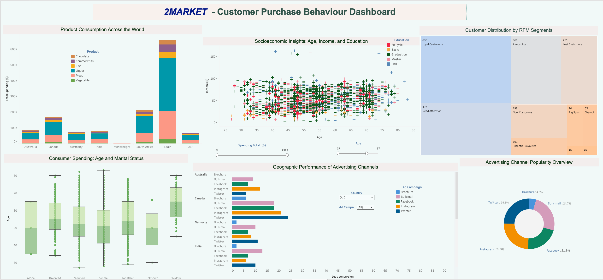

# *2MARKET* Supermarket Customer Data Analysis

🔦 *Disclaimer: I completed the following project as part of the LSE Data Analytics Career Accelearator Course (April 2024 - November 2024)*

🔖 Grade 89%

## How can *2MARKET* improve its marketing strategy and product offerings based on customer purchasing behaviours?

### Overview

This was my first data analytics project, and it was an opportunity to put my problem-solving and analytical skills into practice. I worked with *2MARKET*, a fictitious global supermarket chain, to understand how customer demographics, purchasing habits, and marketing channels influenced sales. My goal was to identify the most profitable advertising channels, uncover spending trends, and determine which products performed best among different customer groups.

I started with Excel for exploratory data analysis (EDA), where I cleaned and organised the dataset to spot initial trends. From there, I moved into SQL (PostgreSQL) to perform deeper, structured analysis of relationships between marketing performance and customer demographics. To bring these insights to life, I created an interactive Tableau dashboard, visualising key spending trends, product performance, and the effectiveness of different marketing channels.

### Approach & Tools

##### 1. Data Wrangling & Exploration

•	Cleaned and prepared the dataset using Excel for initial EDA.

•	Identified key customer spending patterns and seasonal trends.

##### 2. SQL Analysis

•	Imported data into PostgreSQL and used SQL queries to perform descriptive and diagnostic analysis.

•	Examined the effectiveness of marketing channels and customer purchasing behaviour across demographics.

#####  3. Visualisation & Insights

•	Developed an interactive Tableau dashboard to track spending trends, marketing performance, and product sales.

•	Created data-driven recommendations to help 2MARKET refine its marketing and product strategies.

### Business Impact

•	Identified that Spain and South Africa had the highest total spending, while Montenegro had the lowest, revealing regional opportunities for growth.

•	Found that Liquor and Meat were the top-selling categories, suggesting potential promotional opportunities.

•	Discovered that households without children spent more overall, but their purchasing patterns remained similar to households with children.

•	Determined that Twitter had the highest total conversions, while Instagram was most effective in Spain, South Africa, and Australia.

•	RFM analysis revealed that 29% of customers were highly loyal, while 28% were at risk of being lost, highlighting the need for retention strategies.

•	Recommended targeted social media marketing, regional promotions, and improved customer segmentation to drive business growth.

### Key Takeaways

•	Strengthened my SQL skills by applying complex queries for customer and marketing analysis.

•	Gained hands-on experience in Tableau, learning how to translate raw data into meaningful visualisations for decision-makers.

•	Learned structured problem-solving techniques like the Fishbone Method and Five Whys, which helped uncover hidden insights in the data.

•	Saw first-hand how data-driven marketing strategies can impact business growth and how segmentation can improve customer engagement.

